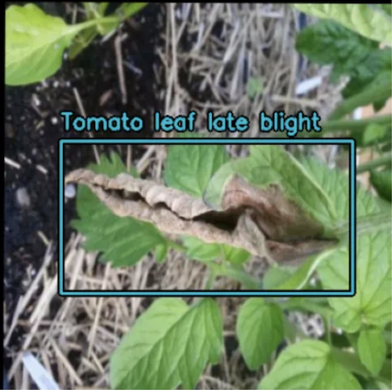
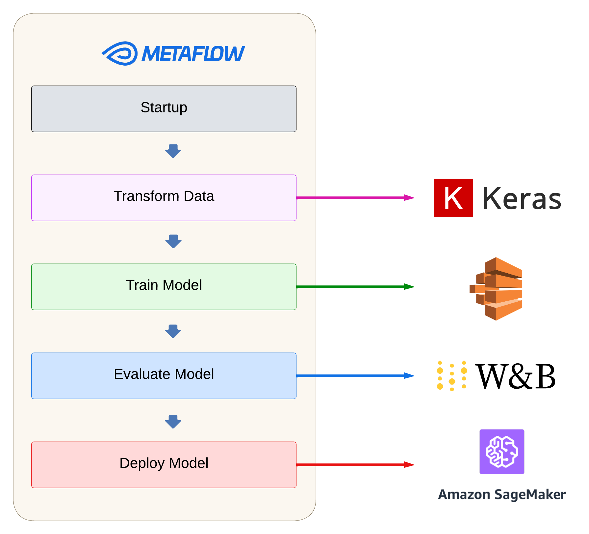

# Detecting Plant Disease
Can we use machine learning to detect diseases in plants?



## Overview
This is a production-grade machine learning application that uses object detection to localize and classify diseases in plants. This is meant to be an educational project for machine learning engineers
to learn how to create an end-to-end computer vision application using Metaflow as the primary orchestration tool. Inspiration was taken from the notable 
[You Don't Need a Bigger Boat](https://github.com/jacopotagliabue/you-dont-need-a-bigger-boat) repo, which shows a more complicated flow based on training a recommendation model.

## Data Source
The data for this project is from the [PlantDoc dataset](https://public.roboflow.com/object-detection/plantdoc?ref=blog.roboflow.com), published on the Roboflow website. 
It contains 2,569 images across 13 plant species and 30 classes (diseased and healthy) for image classification and object detection. It is under a CC BY 4.0 license, which allows
for the remixing, transforming, and building upon the images for any purpose, even commercially.

## Metaflow
This project uses Metaflow as the orchestration and infrastructure abstraction tool. Below you can see what other best-in-class tools are used for this project.



- **Data transformation: KerasCV**. This is a horizontal extension of the Keras library that includes many helpful abstractons for computer vision tasks, in this
  case object detection. The pre-trained RetinaNet model is also obtained from the KerasCV library.
- **Model training: AWS Batch**. Compute for fine-tuning is provided via AWS Batch. This is a fully managed service by Amazon that can dynamically provision the
  appropriate compute instances for our training task. If you are using the provided CloudFormation template, this will be accomplished via a
  [p3.2xlarge instance](https://aws.amazon.com/ec2/instance-types/).
- **Model evaluation: Weights and Biases**. All training metrics including MaP, training loss, and ground truth vs. predicted bounding boxes are logged in WandB.
- **Model deployment: AWS Sagemaker**. The trained model is sent to an AWS Sagemaker endpoint, where it can provide predictions for images submitted into the application.

## Prerequistes
The following packages must be installed and configured before you are able to run the project:
- [Weights and Biases](https://docs.wandb.ai/quickstart): Install the wandb client and log into wandb from the command line. In addition, you will need to create a project. Title it anything you want, and make note of your username (entity). Both of these values will be needed for the next steps. 
- [AWS](https://aws.amazon.com/free/?all-free-tier.sort-by=item.additionalFields.SortRank&all-free-tier.sort-order=asc&awsf.Free%20Tier%20Types=*all&awsf.Free%20Tier%20Categories=*all): Sign up for an AWS account. You can get away with a free account, however understand that if you want to provision an instance on AWS with a CPU/GPU instance, this will cost money.
- [Metaflow](https://docs.metaflow.org/getting-started/install): Install Metaflow on your local machine.
- [Metaflow with AWS](https://outerbounds.com/engineering/deployment/aws-managed/introduction/): In addition to installing Metaflow locally, you will need to configure Metaflow to work with AWS to provision CPU/GPU instances for model training. I recommend using the Metaflow setup with AWS managed services. Instead of the Cloud Formation included in the link, use the `metaflow_setup/metaflow-cfn-gpu.yaml` file included in this repository. I recommend naming the stack **metaflow** for easy setup.

## How to run
### Virual Env
Setup a virtual environment with the project dependencies:
```
conda create --name plant-detection python=3.11
conda activate plant-detection
pip install -r requirements.txt
```
Create a local version of the `local.env` file and name it `.env`. Fill out the relevant value for each key in the file. In this case there are four env values:
- S3_BUCKET_ADDRESS: Bucket address of your S3 bucket. Obtained when running `download_and_upload.py` file, see below
- WANDB_API_KEY: API Key obtained from Weights and Biases
- WANDB_ENTITY: Name of entity, obtained from Weights and Biases
- WANDB_PROJECT: Name of project, obtained rom Weights and Biases


