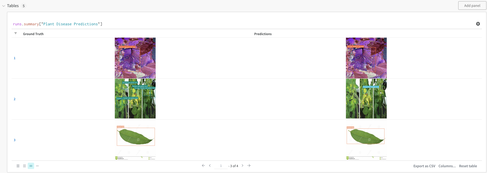
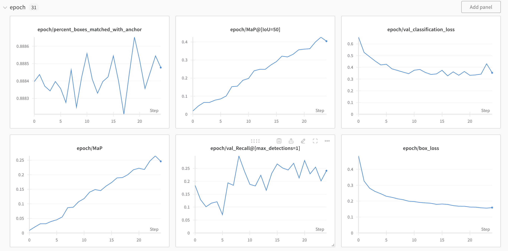

# Detecting Plant Disease
Can we use machine learning to detect diseases in plants?


## Overview
This is a production-grade machine learning application that uses object detection to localize and classify diseases in plants. This is meant to be an educational project for machine learning engineers
to learn how to create an end-to-end computer vision application using Metaflow as the primary orchestration tool. Inspiration was taken from the notable 
[You Don't Need a Bigger Boat](https://github.com/jacopotagliabue/you-dont-need-a-bigger-boat) repo, which shows a more complicated flow based on training a recommendation model.

Check out [this article](https://medium.com/towards-data-science/object-detection-using-retinanet-and-kerascv-b07940327b6c) I wrote in _Towards Data Science_ discussing an earlier, dev project I made using the same dataset in a Jupyter notebook.

## Data Source
The data for this project is from the [PlantDoc dataset](https://public.roboflow.com/object-detection/plantdoc?ref=blog.roboflow.com), published on the Roboflow website. 
It contains 2,569 images across 13 plant species and 30 classes (diseased and healthy) for image classification and object detection. It is under a CC BY 4.0 license, which allows
for the remixing, transforming, and building upon the images for any purpose, even commercially.

## Metaflow
This project uses Metaflow as the orchestration and infrastructure abstraction tool. Below you can see what other best-in-class tools are used for this project.


- **Data transformation: KerasCV**. This is a horizontal extension of the Keras library that includes many helpful abstractons for computer vision tasks, in this
  case object detection. The pre-trained RetinaNet model is also obtained from the KerasCV library.
- **Model training: AWS Batch**. Compute for fine-tuning is provided via AWS Batch. This is a fully managed service by Amazon that can dynamically provision the
  appropriate compute instances for our training task. If you are using the provided CloudFormation template, this can be accomplished via a
  [p3.2xlarge GPU instance](https://aws.amazon.com/ec2/instance-types/).
- **Model evaluation: Weights and Biases**. All training metrics including MaP, training loss, and ground truth vs. predicted bounding boxes are logged in WandB.
- **Model deployment: AWS Sagemaker**. The trained model is sent to an AWS Sagemaker endpoint, where it can provide predictions for images submitted into the application.

*Note:* the *Transform Data* and *Train Model* steps are actualy combined into one step in the code. Originally they were seperated; however, this meant the transformed data had to be uploaded to S3 and then downloaded in the train step, which took a long time. Checkout the *separate_augment_and_train* branch to see what separated steps would look like. 

## Prerequistes
The following packages must be installed and configured before you are able to run the project:
- [Weights and Biases](https://docs.wandb.ai/quickstart): Install the wandb client and log into wandb from the command line. In addition, you will need to create a project in the W&B web portal. Title it anything you want, and make note of both the project name and your username (entity). Both of these values will be needed for the next steps. 
- [AWS](https://aws.amazon.com/free/?all-free-tier.sort-by=item.additionalFields.SortRank&all-free-tier.sort-order=asc&awsf.Free%20Tier%20Types=*all&awsf.Free%20Tier%20Categories=*all): Sign up for an AWS account. You can get away with a free account, however understand that if you want to provision an instance on AWS with a CPU/GPU instance, this will cost money. *Note*: as of July 2024, when you create a new account in AWS, you will not be allowed to create GPU instances out of the gate. You will have to request a quota increase from AWS. This is done to prevent you from spending too much money (**Make sure to delete your AWS Cloud Formation stack when finished with testing this repo, to avoid incurring costs!**). To do this, go to the `Service Quotas` dashboard in AWS. Under 'Manage Quotas', type in 'Amazon Elastic Compute Cloud (Amazon EC2)' and click 'View Quotas'. Under 'Service Quotas' type in 'Running On-Demand P instances' and click  on it. Then click on 'Request increase at account level'. Then, under 'Increase quota value' type in 8. Finally click on 'Request'. AWS will take a few days to get back to. 8 VCPUs is enough to provision a `p3.2xlarge` instance, which is plenty compute for this project.
- [Metaflow](https://docs.metaflow.org/getting-started/install): Install Metaflow on your local machine.
- [Metaflow with AWS](https://outerbounds.com/engineering/deployment/aws-managed/introduction/): In addition to installing Metaflow locally, you will need to configure Metaflow to work with AWS to provision CPU/GPU instances for model training. Instead of the Cloud Formation template found on the Metaflow GitHub, use the `metaflow_setup/metaflow-cfn-gpu.yaml` file included in this repository. I recommend naming the stack **metaflow** for easy setup.
- **Create an IAM role with Sagemaker permission:** In order to create the Sagemaker endpoint that can be pinged to get predictions, you will need to create an IAM role with permission to create Sagemaker resources. To do this, go to the IAM dashboard in AWS, click on 'Role' in the sidebar, and click on **Create role**. Then for 'Select trusted entity' pick 'AWS service', and for 'Use case' type 'Sagemaker - Execution' and then hit Next. Hit Next again, then give the role a meaningful name. Click 'Create role'.  We are not done yet. Although we gave the role Sagemaker permission, we have not given it access to your S3 bucket. To do this, click on your newly created Sagemaker role, and under 'Add permissions' click on 'Attach policies'. In the search bar, type in 'AmazonS3FullAccess', check the box next to the row, and click on 'Add permissions'. Finally, in your newly created role, note the ARN, this will be needed later.
- [Kaggle](https://www.kaggle.com/datasets/edizaguirre/plants-dataset): The dataset for this repository has been uploaded to Kaggle. To programmatically access the data, you will need to create a Kaggle account, and [create an API key](https://christianjmills.com/posts/kaggle-obtain-api-key-tutorial/). Note the username and key found in the `kaggle.json` file, as these will be set in the .env file. 

## How to run
### 1) Virual Env
Setup a virtual environment with the project dependencies:
```
conda create --name plant-detection python=3.11
conda activate plant-detection
pip install -r requirements.txt
```

### 2) Set environment variables
Create a local version of the `local.env` file and name it `.env`. Fill out the relevant value for each key in the file. Make sure to include the .env file in your .gitignore to avoid uploading all of your precious keys to a public GitHub. In this case there are seven env values:
- S3_BUCKET_ADDRESS: Bucket address of your S3 bucket. Obtained when running `download_and_upload.py` file, see below
- IAM_ROLE_SAGEMAKER: ARN of Sagemaker role configured to access your S3 buckets, as described in prerequisites
- WANDB_API_KEY: API Key obtained from Weights and Biases
- WANDB_ENTITY: Name of entity (your username), obtained from Weights and Biases
- WANDB_PROJECT: Name of project, obtained from Weights and Biases
- KAGGLE_USERNAME: Your Kaggle username
- KAGGLE_KEY: Your Kaggle API key

### 3) Configure Metaflow on your device
Run the following commands to confiure Metaflow on your local device:
```
cd metaflow_setup
STACK_NAME=metaflow 
python mf_configure.py -s $STACK_NAME
```
*Note: Change the STACK_NAME value if you called your AWS stack something other than **metaflow**. You will also need to change the names of the job queues in main_flow.py.*

Make sure to run this only after your stack has been created in Metaflow. Note that this will output the name of your S3 bucket. Take this value and add it to your .env file for the `S3_BUCKET_ADDRESS`. 

These steps can be done in lieu of manually copying the values from the output of the stack creation in AWS.

### 4) Download Kaggle data and upload to S3 bucket
Now run the following. 
```
cd ..
python download_and_upload.py
```
This will change directories out of the `mf_configure/` folder and programatically download the data from Kaggle using your username and credentials. It will then upload the data to your S3 bucket.

There should be a success message if the data has been successfully uploaded.

### 5) Configure your flow
At this point you should decide if you want to run the training step of the flow locally, on a provisioned CPU in AWS, or a provisioned GPU in AWS. This will involve commenting out decorators. The following decorators are located above the `train_model` step:

```
@pip(libraries={'tensorflow': '2.15', 'keras-cv': '0.9.0', 'pycocotools': '2.0.7', 'wandb': '0.17.3'})
@batch(gpu=1, memory=8192, image="docker.io/tensorflow/tensorflow:latest-gpu", queue="job-queue-gpu-metaflow")
@batch(memory=15360, queue="job-queue-metaflow")
@environment(vars={
    "S3_BUCKET_ADDRESS": os.getenv('S3_BUCKET_ADDRESS'),
    'WANDB_API_KEY': os.getenv('WANDB_API_KEY'),
    'WANDB_PROJECT': os.getenv('WANDB_PROJECT'),
    'WANDB_ENTITY': os.getenv('WANDB_ENTITY')})
```
- **For AWS GPU compute**: Comment out the `@batch(memory=15360, queue="job-queue-metaflow")`
- **For AWS CPU compute**: Comment out the `@batch(gpu=1, memory=8192, image="docker.io/tensorflow/tensorflow:latest-gpu", queue="job-queue-gpu-metaflow")` decorator.
- **For local compute**: Comment out all four decorators.

By default, the code is configured to run on a CPU instance in AWS Batch.

You should also consider running a test of the flow with only one batch, to make sure that the flow is working. This is the default setup in this repo. To run on all of the data, modify the TESTING parameter: 

```
TESTING = Parameter(
        name='testing',
        help='Determines if only one batch of data is used for testing purposes',
        default=True)
```

There is also a parameter for the instance used to power the AWS Sagemaker endpoint (`SAGEMAKER_INSTANCE`). I have chosen a cheap instance for the Sagemaker endpoint: `ml.t2.medium`; feel free to upgrade this for better performance.

Finally, you will have to customize the `iou_threshold` and `confidence_threshold` values for in the config dictionary. These
values control the non-max suppression algorithm in the RetinaNet object detector. Non-max supression takes all of the bounding boxes predicted by the model and prunes them by only selecting boxes that have high confidence and that don't overlap too much with respect to the intersection over union (IoU) threshold. To learn more about non-max suppression, see [this article](https://www.tensorflow.org/api_docs/python/tf/image/combined_non_max_suppression).

### 6) Run the flow!
Now change directories into the `src/` folder. And run the flow.

```
cd src
python main_flow.py run
```
This will run the Metaflow flow. If successful, you should be able to see the endpoint that has been deployed to Sagemaker:

```
Endpoint name is: detection-xxxxxxxxxxx-endpoint
```
in addition to predicted bounding boxes for a sample image obtained from your running endpoint. In addition, you will get a congratulatory message:
```
All done. 

Congratulations! Plants around the world will thank you.
```

The code is configured to automatically delete the Sagemaker endpoint after testing it. If you'd like to keep the endpoint, comment out this code. **Make sure to delete your AWS Cloud Formation stack when finished, to avoid incurring costs!**

You can now go and evaluate your model's performance on a slice of the validation data in the Weights and Biases dashboard. By logging into the WandB website and selecting your run, you can see the ground truth bounding boxes and the predicted bounding boxes provided in a table.



We can also observe charts detailing important training info, including MaP vs. epoch, box loss vs. epoch, classification loss vs. epoch, etc. 



